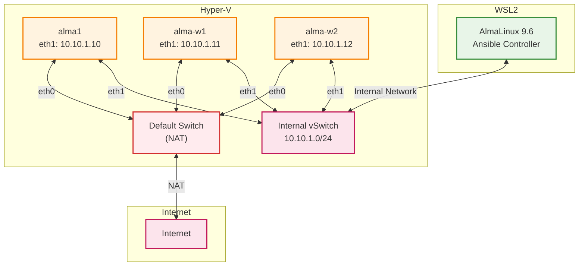

# kubesprayによるKubernetes環境構築：事前設定から実行まで

プライベートで随分久しぶりにKubernetes (k8s) クラスターを構築する機会があり、せっかくなのでkubesprayを使ってみました。公式ドキュメントだけでなく、いろいろなブログ記事を参考にさせていただいたのですが事前設定などで古い情報が散見されました。
（こればっかりはしょうがない。）
今は各マシンに対して何を設定しておかないといけないのかを整理しつつ、kubesprayを使用したクラスター構築方法をまとめます。今回はkubespayのv2.28.0を使って検証しました。

## 私が気になっていたところ

- net.ipv4.ip_forwardを事前に1に設定する必要はない。
  ドキュメントを読むと事前に設定しろと書いていますが、kubespray中で設定が入りました。
- 事前に設定しないならfirewallは止めておく。
  kubesprayの中にfirewall/ufw停止用のplaybookがあるのでそれを使って設定すれば問題ありません。
- SELinuxも無効化して構築するのが無難。
  SELinuxをPermissiveにした時と、Enforcingにした時の結果でRECAPを比較してもfailed/ignoredの数に違いはありませんでした。ただし、SELinuxのdontauditルールを無効化してからkubesprayを実行すると、いくらか拒否ログが出ていました。
  今回は詳細までは調べませんでしたが、Permissiveに設定しておくのが無難かなと思います。（デフォルト設定ではkubesprayの実行中、SELinuxをPermissiveモードに変更してくれます。）

ここら辺の詳しい話は[kubesprayを使うにあたって調べたこと](#kubesprayを使うにあたって調べたこと)に記載します。

## kubesprayとは

Ansibleをベースにしたk8sクラスター自動構築ツールです。Virtual Machine (VM) からAWSなどのクラウドまで、幅広い環境に対してProduction Readyなk8sクラスターを構築できます。


## インフラ構成

今回使った環境です。Hyper-V上のVMにk8sクラスターを構築します。WSL2マシンからkubesprayを実行します。

### VM

| VM名 | OS | vCPU | メモリ | ストレージ | eth1のIPアドレス | 役割 |
|------|----|----- |--------|--------|------------|------|
| alma1 | AlmaLinux 9.6 | 2 | 4GB | 20GB | 10.10.1.10/24 | コントロールプレーン |
| alma-w1 | AlmaLinux 9.6 | 2 | 2GB | 20GB | 10.10.1.11/24 | ワーカー |
| alma-w2 | AlmaLinux 9.6 | 2 | 2GB | 20GB | 10.10.1.12/24 | ワーカー |

### WSL

OS: AlmaLinux 9.6  
Python3: 3.12.9

### 構成図



## 事前準備

kubesprayはAnsibleを使ってk8sのコンポーネントをデプロイするので、Ansibleの実行に必要なものは一通りそろえておきましょう。

### Python3のインストール

kubesprayのv2.28.0ではAnsible実行マシン(WSL2側)で利用するPython3にバージョン制限があります。適切なバージョンを指定してインストールしましょう。
また、RHEL9のcloneであるAlma Linux 9系ではPythonを複数バージョンインストールしてもalternativesの設定が入りません。必要なら手動で設定しましょう。

WSL2で以下実行
```
$ sudo dnf install python3.12
$ sudo alternatives --install /usr/bin/python3 python3 /usr/bin/python3.12 1
$ sudo alternatives --config python3
```

### 鍵の作成・登録

WSL2のマシンでsshアクセス用の公開鍵・秘密鍵を作成し、各VMに登録します。

```{bash}
$ ssh-keygen -t ed25519
$ ssh-copy-id -i ~/.ssh/id_ed25519.pub [ansible実行ユーザー]@[リモートサーバーのIP]
```

ssh-copy-idコマンドは各サーバーに向かって実行します。

## kubesprayの準備・設定

さて、本題に入ります。ここからはkubesprayを準備します。

### kubesprayのコードを準備

kubesprayのリポジトリからコードをcloneします。
今回は2025年7月15日時点の最新バージョンであるv2.28のブランチを指定してcloneします。

```{bash}
$ git clone git@github.com:kubernetes-sigs/kubespray.git -b v2.28.0
```

### Pythonパッケージをインストール

kubesprayの実行に必要なパッケージをインストールします。[手順](https://kubespray.io/#/docs/ansible/ansible?id=installing-ansible)通りにコマンドを実行します。

```
$ VENVDIR=kubespray-venv
$ KUBESPRAYDIR=kubespray
$ python3 -m venv $VENVDIR
$ source $VENVDIR/bin/activate
(kubespray-venv) $ cd $KUBESPRAYDIR
(kubespray-venv) $ pip install -U -r requirements.txt
```

### inventoryの準備

元のコードに存在する以下のinventoryを編集して使用します。

> kubespray/inventory/sample/inventory.ini

sampleディレクトリの名前が気に食わなかったら修正してください。

私は以下のように修正しました。

```:inventory.ini
[kube_control_plane]
alma1 ansible_host=10.10.1.10 ip=10.10.1.10 etcd_member_name=etcd1

[etcd:children]
kube_control_plane

[kube_node]
alma-w1 ansible_host=10.10.1.11 ip=10.10.1.11
alma-w2 ansible_host=10.10.1.12 ip=10.10.1.12
```

- ansible_host: Ansible実行対象のIPです。ansible実行マシンからアクセスできるIPを指定します。
- ip: k8sのサービスが待ち受けするIPアドレスです。通常はパブリック側のIPを指定するのですが、eth0側は固定IPにしていないのでeth1側のIPを指定しています。
- etcd_member_name: etcdクラスターのメンバーを識別する名前です。etcdをインストールするノードにはこの変数を設定する必要があります。


### 特権昇格するパスワードの用意

kubesprayには実行時にroot権限が必要な操作が複数存在します。
Ansible実行対象で利用するアカウントがrootではない場合、Ansible実行ユーザーのパスワードをkubesprayに教えてあげる必要があります。playbook実行時に```-b```のフラグを使うものとして、ansible_become_passwordを用意します。
検証環境のレベルでは不要ですが、今回はansible-vaultを使ってパスワードを暗号化します。

```
$ cd <kubesprayをクローンしたディレクトリ>/inventory/mycluster/group_vars/all
$ export EDITOR=vim
$ ansible-vault create vault.yml
```
ここでVault password (暗号化ファイルの復元用パスワード) を指定します。
すると、vimでファイルの編集ができるので、ansible_become_passwordを入力します。

```yaml:vault.yml
---
ansible_become_password: "<使用するパスワード>"
```

:::message alert
Vault passwordは繰り返し使用するので忘れないように安全な場所に保管してください。
:::

EDITOR変数はansible-vaultコマンドを使用した際に、どのエディターを使用するかを指定するものです。デフォルトではviですが、Alma Linux 9.6のWSLにはviが入っていなかったため、vimを指定しています。


## kubesprayの実行

### クラスターを構築する前に
firewallを止めておきます。適切なポートをあらかじめ開けているのなら大丈夫ですが、設定していない場合構築に失敗しました。kubespray/contrib配下にfirewallを止めるためのplaybookが存在するので、そちらを使います。

まずdisable_service_firewall変数をfalseからtrueに書き換えます。
こちらを書き換えないとfirewallを停止するtaskがskipされます。
```
$ cd <kubesprayをクローンしたディレクトリ>
$ vim contrib/os-services/roles/prepare/defaults/main.yml
```
```yaml:main.yml
---
disable_service_firewall: true
```

次に、firewall停止用playbook（contrib/os-services/os-services.yml）を指定して、ansibleを実行します。

```
$ ansible-playbook -i inventory/mycluster/inventory.ini -u <ansible実行ユーザー名> -b -v --ask-vault-pass --private-key=~/.ssh/id_ed25519 contrib/os-services/os-services.yml
```
--ask-vault-passオプションを使用して暗号化したファイルを復号できるようにします。vault passwordが聞かれるので入力します。これで全台のfirewalldが停止されます。

### クラスターの構築

それでは、k8sクラスターを構築します。
以下のコマンドを実行すれば構築が始まります。
```
$ ansible-playbook -i inventory/mycluster/inventory.ini -u <ansible実行ユーザー名> -b -v --ask-vault-pass --private-key=~/.ssh/id_ed25519 cluster.yml
```
実行時にvaut passwordを入力します。
今回使った構成では10分程度で構築が完了しました。

全てを確認したわけではないですが、以下のようなリソースが作成されます。
```
[root@alma1 ~]# kubectl get nodes,all,secrets -A
NAME           STATUS   ROLES           AGE   VERSION
node/alma-w1   Ready    <none>          98m   v1.32.5
node/alma-w2   Ready    <none>          98m   v1.32.5
node/alma1     Ready    control-plane   98m   v1.32.5

NAMESPACE     NAME                                           READY   STATUS    RESTARTS   AGE
kube-system   pod/calico-kube-controllers-588d6df6c9-ccsld   1/1     Running   0          97m
kube-system   pod/calico-node-97j67                          1/1     Running   0          97m
kube-system   pod/calico-node-blj4v                          1/1     Running   0          97m
kube-system   pod/calico-node-kfbnv                          1/1     Running   0          97m
kube-system   pod/coredns-5c54f84c97-h62m9                   1/1     Running   0          97m
kube-system   pod/coredns-5c54f84c97-k8qt2                   1/1     Running   0          97m
kube-system   pod/dns-autoscaler-56cb45595c-b828j            1/1     Running   0          97m
kube-system   pod/kube-apiserver-alma1                       1/1     Running   1          98m
kube-system   pod/kube-controller-manager-alma1              1/1     Running   2          98m
kube-system   pod/kube-proxy-76tld                           1/1     Running   0          98m
kube-system   pod/kube-proxy-br289                           1/1     Running   0          98m
kube-system   pod/kube-proxy-v7cqg                           1/1     Running   0          98m
kube-system   pod/kube-scheduler-alma1                       1/1     Running   1          98m
kube-system   pod/nginx-proxy-alma-w1                        1/1     Running   0          98m
kube-system   pod/nginx-proxy-alma-w2                        1/1     Running   0          98m
kube-system   pod/nodelocaldns-4jmmh                         1/1     Running   0          97m
kube-system   pod/nodelocaldns-4vcqq                         1/1     Running   0          97m
kube-system   pod/nodelocaldns-td66c                         1/1     Running   0          97m

NAMESPACE     NAME                 TYPE        CLUSTER-IP   EXTERNAL-IP   PORT(S)                  AGE
default       service/kubernetes   ClusterIP   10.233.0.1   <none>        443/TCP                  98m
kube-system   service/coredns      ClusterIP   10.233.0.3   <none>        53/UDP,53/TCP,9153/TCP   97m

NAMESPACE     NAME                          DESIRED   CURRENT   READY   UP-TO-DATE   AVAILABLE   NODE SELECTOR            AGE
kube-system   daemonset.apps/calico-node    3         3         3       3            3           kubernetes.io/os=linux   97m
kube-system   daemonset.apps/kube-proxy     3         3         3       3            3           kubernetes.io/os=linux   98m
kube-system   daemonset.apps/nodelocaldns   3         3         3       3            3           kubernetes.io/os=linux   97m

NAMESPACE     NAME                                      READY   UP-TO-DATE   AVAILABLE   AGE
kube-system   deployment.apps/calico-kube-controllers   1/1     1            1           97m
kube-system   deployment.apps/coredns                   2/2     2            2           97m
kube-system   deployment.apps/dns-autoscaler            1/1     1            1           97m

NAMESPACE     NAME                                                 DESIRED   CURRENT   READY   AGE
kube-system   replicaset.apps/calico-kube-controllers-588d6df6c9   1         1         1       97m
kube-system   replicaset.apps/coredns-5c54f84c97                   2         2         2       97m
kube-system   replicaset.apps/dns-autoscaler-56cb45595c            1         1         1       97m

NAMESPACE     NAME                            TYPE                            DATA   AGE
kube-system   secret/bootstrap-token-106kcc   bootstrap.kubernetes.io/token   4      98m
kube-system   secret/bootstrap-token-dyd7ys   bootstrap.kubernetes.io/token   6      98m
kube-system   secret/bootstrap-token-l5skvp   bootstrap.kubernetes.io/token   6      98m
kube-system   secret/bootstrap-token-m16j54   bootstrap.kubernetes.io/token   4      98m
kube-system   secret/bootstrap-token-rr9hxh   bootstrap.kubernetes.io/token   6      98m
kube-system   secret/bootstrap-token-wbrk3p   bootstrap.kubernetes.io/token   6      98m
kube-system   secret/kubeadm-certs            Opaque                          9      98m
```

上記の実行方法ではAnsible実行ユーザーの```$HOME```には```.kube/config```が作成されません。rootユーザーに切り替えてからkubectlコマンドを実行する必要があります。

:::message
kubesprayはインストールするバイナリファイルを/usr/local/binに配置します。```sudo -i```コマンドと```sudo su -```コマンドはどちらもrootユーザーに移行できますが、rootになった時に設定される環境変数に違いが出ます。
```sudo -i```では/usr/local/binが$PATHに設定されないので```sudo su -```を使います。
:::

## kubesprayを使うにあたって調べたこと

### net.ipv4.ip_forwardの設定

k8sではノード間のパケット転送などにIP転送機能を使用します。そのためnet.ipv4.ip_forwardもしくはnet.ipv6.ip_forwardが有効化されている必要があります。公式ドキュメントの[Requirements](https://kubespray.io/#/?id=requirements)を読むと、IPv4 forwardingが設定されている必要があると記載されています。ただ、前述の通りkubesprayの中でnet.ipv4.ip_forwardを有効化する処理が走りました。kubespray実行前に設定する必要はありませんでした。

処理を実行しているのは以下となります。

```yaml:kubespray/roles/kubernetes/preinstall/tasks/0080-system-configurations.yml
- name: Enable ip forwarding
  ansible.posix.sysctl:
    sysctl_file: "{{ sysctl_file_path }}"
    name: net.ipv4.ip_forward
    value: "1"
    state: present
    reload: true
  when: ipv4_stack | bool
```

### firewallの設定

これは[Requirements](https://kubespray.io/#/?id=requirements)の通りです。firewallはkubesprayの管理対象外なので、一度無効化し、後から適切なポートを開けてください。


### SELinuxの設定

ドキュメントを読むと```preinstall_selinux_state```という変数を指定できると書いており[^1]、SELinuxをEnforcingにしてもクラスターを構築できそうな雰囲気はあります。
ただ、上記変数以外でSELinuxについて触れておらず、いろいろなブログを見るとSELinuxは無効化すると書いていたので検証しました。
[^1]: https://kubespray.io/#/docs/ansible/vars?id=common-vars-that-are-used-in-kubespray


まずはSELinuxのdontauditルールを無効化します。dontauditルールとはサイレント拒否とも呼ばれる、AVC拒否がログに記録されないルールの事です。
無効化していない状態ではトラブルシューティングが難しくなります。

クラスターを構築する前に設定したいので、firewall停止用playbookに以下を追加しました。
```yaml:kubespray/contrib/os-services/os-services.yml
- name: Disable SELinux dontaudit rules
  hosts: all
  become: yes
  tasks:
    - name: Install setools-console
      ansible.builtin.dnf:
        name: setools-console
        state: present

    - name: Disable dontaudit rules
      ansible.builtin.command: semodule -DB
      register: semodule_result
      changed_when: semodule_result.rc == 0
```

kubesprayは実行中にSELinuxの状態を変更します。変更する処理は以下にあります。
```yaml:kubespray/roles/kubernetes/preinstall/tasks/0080-system-configurations.yml
- name: Set selinux policy
  ansible.posix.selinux:
    policy: targeted
    state: "{{ preinstall_selinux_state }}"
  when:
    - ansible_os_family == "RedHat"
    - "'Amazon' not in ansible_distribution"
    - slc.stat.exists
  tags:
    - bootstrap_os
```

```preinstall_selinux_state```のデフォルト値は別のroleで設定されていました。（初めて見る書き方で驚きました。）
```yaml:kubespray/roles/kubespray_defaults/defaults/main/main.yml
# selinux state
preinstall_selinux_state: permissive
```
現状のままではpermissiveになるので、gruop_varsから上書きします。以下の末尾に下記を追記します。
```yaml:kubespray/inventory/sample/group_vars/all/all.yml
preinstall_selinux_state: enforcing
```

検証準備はこれでOKです。[kubesprayの実行](#kubesprayの実行)と同様の手順でansible-playbookコマンドを2回実行します。

kubesprayはansibleをベースとしているので、実行後にはRECAPが表示されます。そこでfailedとignoreeの数をPermissive/Enforcingで比較しても違いはありませんでした。
また、いくつかのリソースを確認しましたが、Permissiveの時と同様の結果を得られています。
```
[root@alma1 ~]# kubectl get nodes,all,secrets -A
NAME           STATUS   ROLES           AGE   VERSION
node/alma-w1   Ready    <none>          44m   v1.32.5
node/alma-w2   Ready    <none>          44m   v1.32.5
node/alma1     Ready    control-plane   44m   v1.32.5

NAMESPACE     NAME                                           READY   STATUS    RESTARTS   AGE
kube-system   pod/calico-kube-controllers-588d6df6c9-zlgxb   1/1     Running   0          43m
kube-system   pod/calico-node-djwpq                          1/1     Running   0          43m
kube-system   pod/calico-node-gt94m                          1/1     Running   0          43m
kube-system   pod/calico-node-n8vsv                          1/1     Running   0          43m
kube-system   pod/coredns-5c54f84c97-mmtnc                   1/1     Running   0          43m
kube-system   pod/coredns-5c54f84c97-xcp5h                   1/1     Running   0          43m
kube-system   pod/dns-autoscaler-56cb45595c-ch9mv            1/1     Running   0          43m
kube-system   pod/kube-apiserver-alma1                       1/1     Running   1          44m
kube-system   pod/kube-controller-manager-alma1              1/1     Running   2          44m
kube-system   pod/kube-proxy-9x52n                           1/1     Running   0          44m
kube-system   pod/kube-proxy-c8jzv                           1/1     Running   0          44m
kube-system   pod/kube-proxy-v8bwv                           1/1     Running   0          44m
kube-system   pod/kube-scheduler-alma1                       1/1     Running   1          44m
kube-system   pod/nginx-proxy-alma-w1                        1/1     Running   0          44m
kube-system   pod/nginx-proxy-alma-w2                        1/1     Running   0          44m
kube-system   pod/nodelocaldns-jjlxh                         1/1     Running   0          43m
kube-system   pod/nodelocaldns-qw5bn                         1/1     Running   0          43m
kube-system   pod/nodelocaldns-tx8j2                         1/1     Running   0          43m

NAMESPACE     NAME                 TYPE        CLUSTER-IP   EXTERNAL-IP   PORT(S)                  AGE
default       service/kubernetes   ClusterIP   10.233.0.1   <none>        443/TCP                  44m
kube-system   service/coredns      ClusterIP   10.233.0.3   <none>        53/UDP,53/TCP,9153/TCP   43m

NAMESPACE     NAME                          DESIRED   CURRENT   READY   UP-TO-DATE   AVAILABLE   NODE SELECTOR            AGE
kube-system   daemonset.apps/calico-node    3         3         3       3            3           kubernetes.io/os=linux   43m
kube-system   daemonset.apps/kube-proxy     3         3         3       3            3           kubernetes.io/os=linux   44m
kube-system   daemonset.apps/nodelocaldns   3         3         3       3            3           kubernetes.io/os=linux   43m

NAMESPACE     NAME                                      READY   UP-TO-DATE   AVAILABLE   AGE
kube-system   deployment.apps/calico-kube-controllers   1/1     1            1           43m
kube-system   deployment.apps/coredns                   2/2     2            2           43m
kube-system   deployment.apps/dns-autoscaler            1/1     1            1           43m

NAMESPACE     NAME                                                 DESIRED   CURRENT   READY   AGE
kube-system   replicaset.apps/calico-kube-controllers-588d6df6c9   1         1         1       43m
kube-system   replicaset.apps/coredns-5c54f84c97                   2         2         2       43m
kube-system   replicaset.apps/dns-autoscaler-56cb45595c            1         1         1       43m

NAMESPACE     NAME                            TYPE                            DATA   AGE
kube-system   secret/bootstrap-token-16bbjs   bootstrap.kubernetes.io/token   6      44m
kube-system   secret/bootstrap-token-3ryr54   bootstrap.kubernetes.io/token   4      44m
kube-system   secret/bootstrap-token-c56lx6   bootstrap.kubernetes.io/token   6      44m
kube-system   secret/bootstrap-token-gcbiw7   bootstrap.kubernetes.io/token   6      44m
kube-system   secret/bootstrap-token-h45avh   bootstrap.kubernetes.io/token   6      44m
kube-system   secret/bootstrap-token-yy26qe   bootstrap.kubernetes.io/token   4      44m
kube-system   secret/kubeadm-certs            Opaque                          9      44m
```

ただし、拒否ログが何種類か出力されていました。
```
# ausearch -m AVC,USER_AVC,SELINUX_ERR,USER_SELINUX_ERR
```
例えば以下のログです。
```
avc:  denied  { read write } for  pid=43198 comm="unix_chkpwd" path="/dev/pts/1" dev="devpts" ino=4 scontext=unconfined_u:unconfined_r:chkpwd_t:s0-s0:c0.c1023 tcontext=unconfined_u:object_r:user_devpts_t:s0 tclass=chr_file permissive=0
```
今回は何の操作が拒否されたかを調べるのことまでしません（ちょっと力つきました）。何かしらの操作が上手くいっていないはずですので、クラスター構築はSELinuxをPermissiveもしくはDisabledにしておくのが無難でしょう。

## まとめ

というわけで、kubesprayを使ってのk8sクラスター構築方法を紹介しました。Ansibleを使える方でしたら簡単にk8sクラスターを構築できるため非常に使い勝手のいいソフトウェアだと思います。
今回はデフォルト設定を使ったクラスター構築の内容にとどまりましたが、クラスターにノードを追加することも可能ですし、kubesprayはcontainerdの代わりにcri-oを使用する、NWプラグインを変更するなどの柔軟な拡張が可能なようです。
ここら辺はまたそのうち検証し、記事として公開したいと思います。
